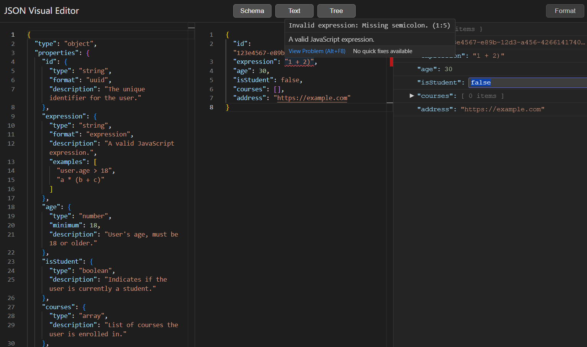

# JSON Visual Editor

👉 **Live Demo**: [https://json-viewer-lemon.vercel.app/](https://json-viewer-lemon.vercel.app/)



A high-performance online JSON visual editor, specifically designed for developers who need advanced Schema
validation and a smooth editing experience for large JSON documents.

It mainly consists of three core views:

1. **Schema View**: Based on Monaco Editor, used for defining and editing JSON Schema.
2. **Text View**: A JSON editor based on Monaco Editor, integrated with advanced custom validation.
3. **Tree View**: Fully virtualized tree structure display that maintains smooth performance even when handling
   extremely large JSON files.

## ✨ Core Features

- **Extensible Validation Engine**: Powered by **AJV (Another JSON Schema Validator)** rather than Monaco's built-in
  validator.
- **Rich Format Support**: Native support for dozens of standard formats through integration with `ajv-formats`, such as
  `"uuid"`, `"uri"`, `"email"`, etc.
- **Custom Validation**: Implemented support for custom `format: "expression"`, using **Babel Parser (`@babel/parser`)**
  to provide JavaScript expression syntax validation and error prompts.
- **High-Performance Architecture**: Built with Vite + React + TypeScript, and implements virtualized rendering for tree
  view through `react-window`.

## 📦 Installation

```bash
# Clone the repository
git clone https://github.com/Wacry/json-visual-editor.git
cd json-visual-editor

# Install dependencies
npm install
```

## 🚀 Running the Application

```bash
# Start the development server
npm run dev
```

The application will be available at http://localhost:5173 by default.

## 🛠️ Dependencies

### Main Dependencies

- **React**: ^19.1.0
- **Monaco Editor**: ^0.52.2
- **AJV**: ^8.17.1
- **@babel/parser**: ^7.27.5
- **react-window**: ^1.8.11

### Development Tools

- **Vite**: ^6.3.5
- **TypeScript**: ~5.8.3
- **ESLint**: ^9.25.0

## 🏗️ Project Structure

- `src/components/SchemaView.tsx`: Schema editor implementation
- `src/components/TextView.tsx`: JSON text editor implementation
- `src/components/TreeView.tsx`: Tree visualization implementation

## 📄 License

MIT